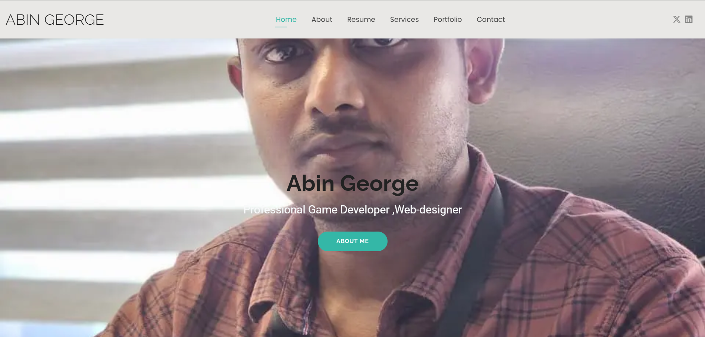
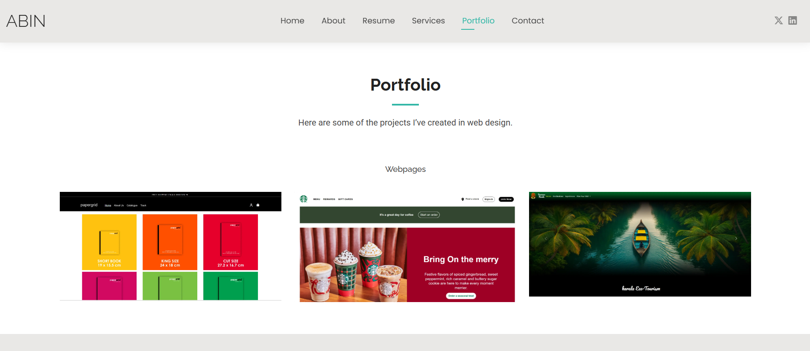
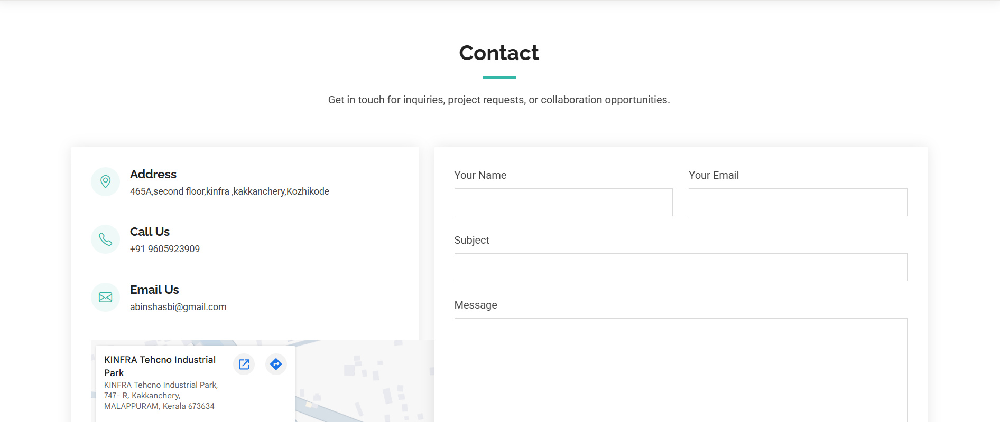

# Personal Portfolio Website

A responsive personal portfolio website built to showcase my projects, skills, services, and development journey.

## Features

- Responsive multi-page layout
- About me section
- Services showcase
- Portfolio/projects section
- Resume page
- Contact page
- Clean UI design

## Technologies Used

- HTML5
- CSS3
- JavaScript

## Project Structure

```bash
Abin-Personal/
│
├── assets/
├── about.html
├── contact.html
├── index.html
├── portfolio.html
├── resume.html
├── services.html
└── starter-page.html
```

## Live Demo

[Visit Portfolio Website](https://abinshasbi-netizen.github.io/Abin-Personal/)

### Homepage


### Portfolio Section


### Contact Page



## Future Improvements

- Add animations and transitions
- Improve mobile responsiveness
- Integrate backend contact form
- Add dark mode support

## Author

Abin George

GitHub: https://github.com/abinshabi-netizen
